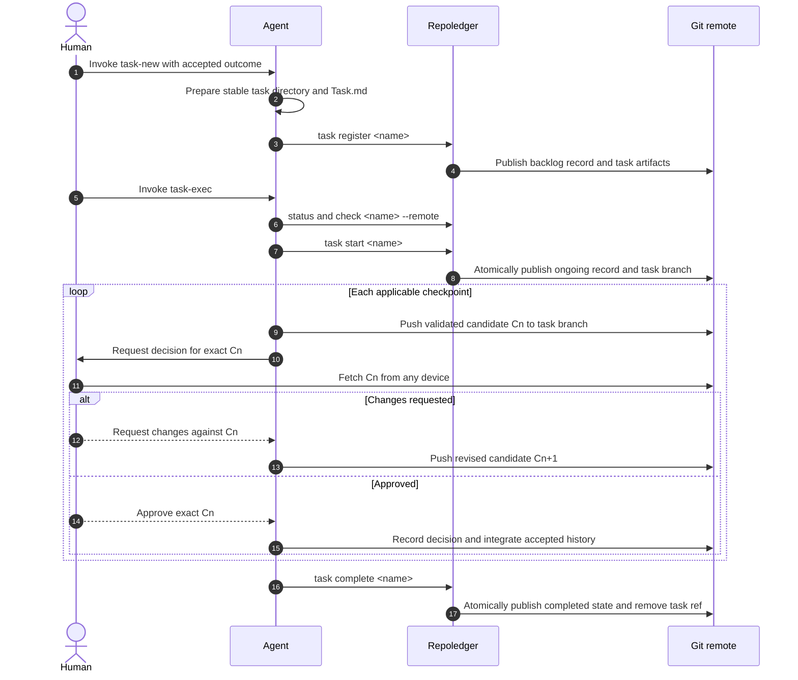

# Repoledger use cases

Status: Proposed for scope and architecture review

## Decision requested

Approve the division of responsibility between humans, agents, repoledger, and
Git, including the checks and repository operations for each use case.
Approval unlocks changes to the task-ledger skills and the internal command
architecture.

The data contracts are defined in
[repoledger storage model](./repoledger-storage-model.md). Exact CLI syntax and
reports are defined in
[repoledger command design](./repoledger-command-design.md).

## Actors and responsibilities

| Actor | Responsibilities | Must not infer or perform |
| --- | --- | --- |
| Human | Define intent, resolve semantic overlap, approve or reject reviewed commits, authorize handoff, and accept delivery. | Git activity is not approval; silence is not a decision. |
| Agent | Prepare task artifacts, invoke repoledger, implement on the recorded branch, validate work, publish review candidates, and record human decisions. | It cannot invent approval, ownership consent, or semantic conflict resolution. |
| Repoledger | Query and validate canonical status, enforce legal transitions, maintain timestamps, and publish operation-owned Git changes. | It does not decide admission, scope overlap, review outcomes, or code correctness. |
| Git remote | Provide compare-and-swap ref updates, shared history, reachability, and cross-device access. | It is not a task lock or a human-review system. |

## End-to-end collaboration

## Human use cases

### Inspect work

The human runs `repoledger status` or asks an agent for the same report.
Repoledger fetches the configured primary branch, reads its status blob without
changing the worktree, and returns tasks sorted by name or timestamp. For an
ongoing task it also reports the collaboration branch and fetched tip.

No state changes, commits, or pushes occur. Network or authentication failure
is reported; `--local` is an explicit offline snapshot rather than a fallback
that could be mistaken for current shared state.

### Admit a task

The human explicitly invokes `task-new` and supplies or confirms one testable
outcome. The agent checks active records for plausible semantic overlap,
applies repository admission policy, and prepares `tasks/<name>/Task.md`.

Repoledger checks that the name is absent, the stable directory and task plan
are valid, and the latest primary branch still has no matching record. It adds
a backlog record, timestamps it, commits only the task directory and status
file, and non-force publishes them. A duplicate or changed same-name task is a
conflict requiring human direction.

### Review a checkpoint from another device

The agent publishes a validated candidate to the recorded collaboration
branch and sends a review envelope containing task, checkpoint, branch, base
commit, candidate commit, artifact, validation, and requested decision.

The human fetches the branch on any device and reviews the exact candidate
commit. An approval or change request explicitly names that commit. Branch
movement after the request does not change the object under review.

### Approve, request changes, or abandon

On approval, the agent records reviewer, date, checkpoint, candidate commit,
and evidence in `Progress.md`, publishes that metadata, refreshes primary, and
revalidates the composed result. Material reconciliation changes reopen the
checkpoint.

On requested changes, the agent leaves status ongoing and pushes a new
candidate. On abandonment, the human or accountable owner supplies the
decision and reason; repoledger only validates and publishes the already
recorded outcome.

### Accept delivery

The human reviews the published implementation, validation evidence, and any
manual acceptance result, then explicitly accepts or rejects delivery at an
immutable commit. Acceptance is recorded and integrated before the agent asks
repoledger to complete the task.

## Agent use cases

### Inventory and select work

1. Run `repoledger status` to read the latest shared state.
2. Run `repoledger check <name> --remote` to validate the selected task,
   primary ref, and collaboration ref when present.
3. Read the stable `Task.md` and `Progress.md` from the appropriate remote
   commit.
4. Compare plausible active scopes semantically. Repoledger can expose records
   and changed paths but cannot decide conceptual overlap.

The agent stops on no match, duplicate identity, invalid artifacts, another
task using the same branch, or an unresolved ownership decision.

### Start backlog work

The agent invokes `task start`. Repoledger fetches primary, verifies the task
is still backlog, selects an unused branch, updates only that record, and
creates one claim commit. It atomically pushes that commit to both primary and
the new collaboration ref, then verifies both fetched refs.

If another actor already started or abandoned the task, changed an owned
artifact, or created the branch, repoledger reports expected and actual state
and publishes nothing.

### Publish a review candidate

The agent works on the collaboration branch, commits only validated progress,
and pushes without force. Before asking for review it refreshes primary,
records the candidate's primary base, and checks whether new primary changes
invalidate the artifact.

Repoledger is not invoked because task lifecycle state remains `ongoing`.
`Progress.md` is the durable checkpoint record; `status.yaml` must not be
edited on the collaboration branch.

### Integrate an approved checkpoint

The agent verifies that the recorded approval names the current candidate,
fetches latest primary, and composes the candidate without changing its
protected result. It reruns applicable validation and creates a no-fast-forward
integration so the reviewed commit remains reachable.

A changed result, merge conflict, failed check, or rejected push reopens the
checkpoint. A clean integration advances primary; the collaboration branch
then fast-forwards to the integration commit so the next checkpoint starts
from accepted shared state.

### Resume or hand off

A receiving agent queries status, fetches the existing collaboration branch,
and verifies its tip against `Progress.md`. Handoff changes no status field and
requires no directory move or branch rename. The agents record the explicit
handoff in progress before either continues.

If both agents publish concurrently, normal non-force branch updates expose
the race. Neither actor force-pushes or silently takes the other one's tip.

### Complete work

After delivery approval is integrated, the agent invokes `task complete`.
Repoledger verifies the record is ongoing, approval and completion facts are
valid on primary, and the task-branch tip is reachable from primary. It writes
the completed record, advances only its `updatedAt`, commits, and atomically
pushes the primary update with deletion of the collaboration ref.

Failure to prove reachability leaves both refs unchanged and the task ongoing.

### Abandon work

For backlog work, the agent records the human decision and reason, invokes
`task abandon`, and repoledger publishes the terminal status.

For ongoing work, the agent first records useful findings and the abandonment
decision on the task branch. Repoledger creates a terminal primary commit that
retains the task artifacts and makes the branch history reachable while
keeping unapproved implementation changes out of the primary tree. It then
atomically advances primary and deletes the collaboration ref. Any ambiguity
about which content is safe to retain is a blocker, not an automatic merge.

### Validate in CI

CI runs `repoledger check --remote`. Repoledger validates canonical files,
task artifacts, state consistency, remote branches, and reachability without
performing a mutation. Diagnostics identify the exact task, path, invariant,
and remediation. CI does not run task transition commands.

## Concurrent-operation cases

| Concurrent change | Repoledger behavior |
| --- | --- |
| Another task record changes on primary | Refetch, reapply the requested transition to the new canonical map, revalidate, and retry a bounded number of times. |
| The selected task record changes | Stop with expected and actual records; never choose a winner. |
| The expected task or primary ref tip moves | Stop or bounded-retry only when the movement is proven unrelated; never force-push. |
| A task-owned artifact changes | Stop with the changed paths and commit IDs. |
| The requested collaboration branch appears or moves | Stop with the expected and actual ref tips. |
| A merge changes an approved result | Reopen the human checkpoint and publish a new candidate. |
| Authentication, permission, or branch protection rejects publication | Preserve local evidence and report the exact external action required. |
| Atomic push is unsupported | Fail before a multi-ref lifecycle transition; do not fall back to sequential partial publication. |

## Repository effects by use case

| Use case | Reads | Writes | Commits and refs |
| --- | --- | --- | --- |
| Inspect | Remote primary status; optional task ref | None | None |
| Register | Prepared task directory; remote primary | Task directory and status in isolated publication state | One primary commit |
| Start | Remote primary; selected record; branch namespace | Selected status record | One claim commit atomically to primary and task branch |
| Prepare/revise review | Task branch; latest primary for context | Task artifacts and implementation on task branch | Ordinary non-force task-branch commits |
| Approve/integrate | Candidate, approval evidence, latest primary | Progress and accepted implementation | Metadata commit plus no-FF primary integration |
| Handoff/resume | Status, task branch, progress | Progress handoff evidence | Ordinary task-branch commit; no status mutation |
| Complete | Primary completion facts; reachable task ref | Selected status record | Atomic primary commit and task-ref deletion |
| Abandon | Decision evidence; primary; optional task ref | Progress and selected status record | Primary terminal commit; optional atomic task-ref deletion |
| Check | Config, status, artifacts, optional remote refs | None | None |
