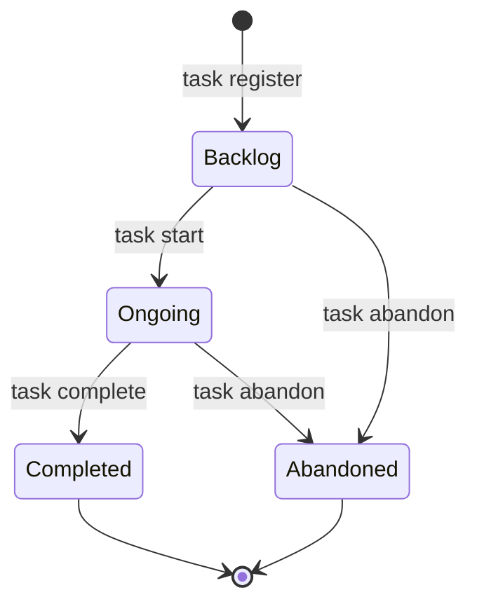

# Repoledger storage model

Status: Proposed for scope, business and data model, and architecture review

## Decision requested

Approve the stable task layout, the two YAML contracts, the four-state task
lifecycle, timestamp semantics, and the migration rules in this document.
Approval unlocks implementation of parsers, schemas, lifecycle transitions,
and repository migration.

## Decisions

- Task state is data in one shared status file, not a directory path.
- Every task keeps one stable directory for its complete lifetime.
- The remote primary branch is authoritative for repository configuration,
  task status, task artifacts, and accepted implementation history.
- Tasks do not store or manage a source branch. A contributor may use a local
  or hosting-provider branch, but it is outside the repoledger protocol and all
  task outcomes must return to primary.
- Detailed plans, implementation progress, and validation remain task
  artifacts; they are not duplicated into the status record. Human decisions
  bind immutable primary commits and do not require approval-only artifact
  commits.

The related human and agent flows are defined in
[repoledger use cases](./repoledger-use-cases.md). CLI behavior is defined in
[repoledger command design](./repoledger-command-design.md).

## Repository layout

```text
repoledger.yaml
tasks/
|-- status.yaml
|-- add-task-entry-skills/
|   |-- Task.md
|   `-- Progress.md
|-- redesign-repoledger-state-management/
|   |-- Task.md
|   `-- Progress.md
`-- some-backlog-task/
    `-- Task.md
```

The configured task directory contains exactly one `status.yaml` and one
directory per task record. Task directories use lowercase kebab-case and never
move when state changes. Every task requires `Task.md`. `Progress.md` is an
implementation journal: an ongoing task may omit it until its first publication
that changes a path outside the configured task directory. Completed tasks
require it. Abandoned tasks require it only if implementation changes were
previously published. Other task-local artifacts, including `UserAcceptance.md`
and design notes, remain allowed.

The status file and task directories have one-to-one correspondence. A missing
record, missing directory, duplicate record, unexpected top-level directory,
or symlink that escapes the repository is invalid.

## Repository configuration

The repository root contains `repoledger.yaml`:

```yaml
version: 1
tasksDirectory: tasks
remote: origin
primaryBranch: main
```

Its TypeScript contract is:

```ts
export type RepoledgerConfig = {
  version: 1;
  tasksDirectory: string;
  remote: string;
  primaryBranch: string;
};
```

All properties are required and unknown properties are invalid.

| Property | Rule |
| --- | --- |
| `version` | Literal integer `1`. An incompatible contract increments this value. |
| `tasksDirectory` | Normalized repository-relative directory. It cannot be absolute, empty, `.` or escape through `..` or symlinks. |
| `remote` | Name of an existing Git remote. It is not a URL. |
| `primaryBranch` | Short branch name accepted by `git check-ref-format --branch`; it has no remote or `refs/` prefix. |

The status path is always `<tasksDirectory>/status.yaml`. There is no separate
status-path setting.

## Task status

```yaml
version: 1
tasks:
  add-task-entry-skills:
    state: completed
    createdAt: "2026-09-15T09:00:00Z"
    updatedAt: "2026-09-16T17:20:00Z"
  redesign-repoledger-state-management:
    state: ongoing
    createdAt: "2026-09-18T08:30:00Z"
    updatedAt: "2026-09-18T09:00:00Z"
  some-backlog-task:
    state: backlog
    createdAt: "2026-09-18T10:00:00Z"
    updatedAt: "2026-09-18T10:00:00Z"
```

Its TypeScript contract is:

```ts
export type TaskStatusFile = {
  version: 1;
  tasks: Record<string, TaskRecord>;
};

export type TaskRecord = {
  state: "backlog" | "ongoing" | "completed" | "abandoned";
  createdAt: string;
  updatedAt: string;
};
```

The mapping key is the exact task-directory name and is the task's immutable
identifier. A record does not repeat its name or encode a source branch,
worktree, device, person, or agent.

## Canonical YAML

Repoledger is the normal writer for both files and emits one canonical form:

- UTF-8, LF line endings, two-space indentation, and one final newline;
- mappings only, with no duplicate keys, anchors, aliases, merge keys, custom
  tags, directives, or comments;
- top-level properties in the order shown by the examples;
- task records sorted by task name using ascending Unicode code-point order;
- record properties ordered as `state`, `createdAt`, then `updatedAt`; and
- timestamps always double-quoted.

Parsing rejects unsupported YAML features instead of silently normalizing
them. Canonical serialization makes status-only Git conflicts readable and
prevents formatting churn from obscuring record changes.

## Timestamp semantics

Both timestamps are UTC strings in exact `YYYY-MM-DDTHH:mm:ssZ` form and must
represent valid instants. Their fixed-width representation sorts
lexicographically by time.

- `createdAt` is set by `task register`, records logical task creation, and is
  immutable.
- `updatedAt` initially equals `createdAt` and changes only when that task
  record changes.
- A mutation sets `updatedAt` to the later of the current UTC second and one
  second after the previous value. This preserves strict monotonicity when two
  transitions occur within one clock second or the local clock moves backward.
- Mutating one record never refreshes timestamps on another record.
- Implementation commits and `Progress.md` edits do not change `updatedAt`
  unless they also perform a lifecycle transition.

The invariants `createdAt <= updatedAt` and
`new.updatedAt > old.updatedAt` for every record mutation are mandatory.

## Lifecycle



Terminal records are retained. There is no delete, rename, reopen, or generic
set-state transition. Corrections use a new task and an explicit reference to
the mistaken or superseded record.

## Git authority

The authoritative status is the `status.yaml` blob on
`refs/remotes/<remote>/<primaryBranch>`. A worktree copy is only an offline
snapshot. Repoledger reads and publishes lifecycle state only through that
configured primary ref.

Task records do not name a source branch. Optional contributor branches and
pull requests are transport choices outside repoledger; the skills may use
them when repository policy requires it, but may not treat them as task state.
Review and delivery decisions name immutable commits. Completion requires the
accepted implementation commit to be reachable from refreshed primary.

## Validation invariants

| Area | Required invariant |
| --- | --- |
| Configuration | One valid `repoledger.yaml`; configured paths and refs are safe and unambiguous. |
| Status syntax | One canonical, strictly parsed `status.yaml` matching the TypeScript union. |
| Identity | Each task name occurs exactly once as a record key and exactly once as a stable directory. |
| Lifecycle | Every observed state change is one legal directed transition. |
| Artifacts | Required task documents exist and their state-dependent facts agree with the status record. Every post-migration commit that creates or edits `Progress.md` also changes at least one path outside the configured task directory. |
| Time | Creation is immutable; updates are per-record and strictly monotonic. |
| History | Required implementation and reviewed commits are reachable from refreshed primary before completion. |

## Migration from layout v1

Migration is one coordinated repository change, not a permanent public
command.

1. Refresh the primary branch and require the current v1 ledger to pass its
   complete validation.
2. Inventory every task across `backlog`, all `ongoing/<identity>` lanes, and
   `archived`; stop on duplicate names or unexpected artifacts.
3. Move each complete directory to `tasks/<task-name>` and update affected
   repository-local links once. Preserve task-local links and every artifact.
4. Map source positions to `backlog` or `ongoing`; derive each archived
   record's terminal state from the unambiguous `Completed` or `Abandoned`
   outcome in `Progress.md`.
5. Derive `createdAt` from the first primary-history commit introducing the
   task's `Task.md`. Set `updatedAt` to the migration operation time because
   this is the first canonical status-record write.
6. Replace `repoledger.json` with `repoledger.yaml`, write canonical
   `tasks/status.yaml`, remove identity markers and obsolete status
   directories, then run both local and remote validation.
7. Publish the migration without force and verify every task, status record,
  and required historical commit from refreshed primary.

Before publication, rollback is deletion of the isolated migration result.
After publication, corrections are forward commits; published history is
never rewritten.

### Progress history rule

For every commit introduced on primary after the migration commit, repoledger
compares that commit with its first parent. If the diff creates or modifies any
`<tasksDirectory>/<task-name>/Progress.md`, the same diff must create, modify,
rename, or delete at least one tracked path outside `<tasksDirectory>/`.
Multiple progress files in one commit share that publication-level condition.

The migration commit and all earlier history are exempt. Repoledger-generated
register, start, complete, and abandon commits never edit `Progress.md`.
Merge commits are checked against their first parent, so a pull-request merge
must present the implementation and progress delta together in the resulting
primary change. This rule is enforced by `check --remote`; local check reports
that history validation was not performed.
