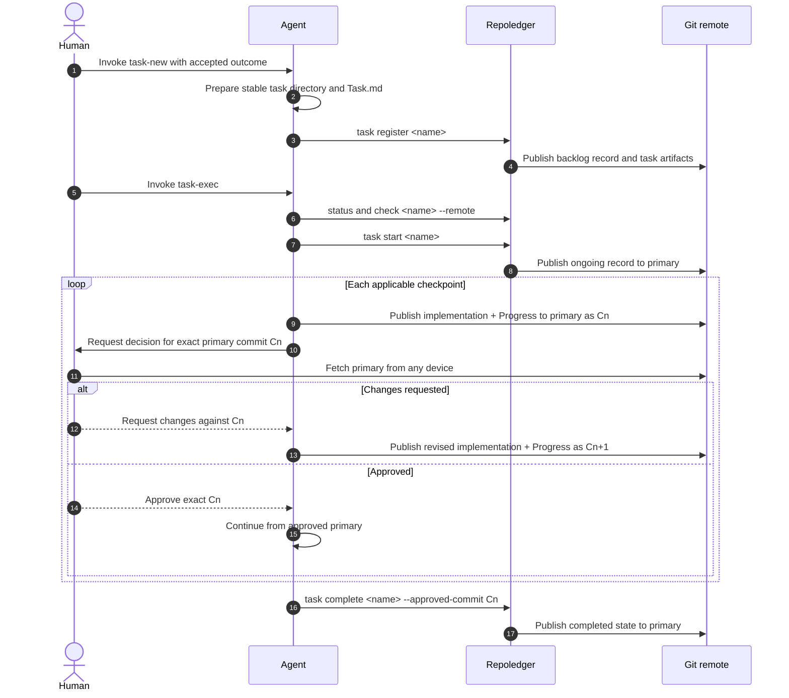

# Repoledger use cases

Status: Proposed for scope and architecture review

## Decision requested

Approve the division of responsibility between humans, agents, repoledger, and
Git, including the checks and repository operations for each use case.
Approval unlocks changes to the task-ledger skills and the internal command
architecture.

The data contracts are defined in
[repoledger storage model](./repoledger-storage-model.md). Exact CLI syntax and
reports are defined in
[repoledger command design](./repoledger-command-design.md).

## Actors and responsibilities

| Actor | Responsibilities | Must not infer or perform |
| --- | --- | --- |
| Human | Define intent, resolve semantic overlap, approve or reject reviewed commits, and accept delivery. | Git activity is not approval; silence is not a decision. |
| Agent | Prepare task artifacts, invoke repoledger, implement from refreshed primary, validate work, and publish implementation plus concise progress evidence together. | It cannot invent approval or semantic conflict resolution, and it must not create bookkeeping-only progress commits. |
| Repoledger | Query and validate canonical status, enforce legal transitions, maintain timestamps, and publish operation-owned Git changes. | It does not decide admission, scope overlap, review outcomes, or code correctness. |
| Git remote | Provide compare-and-swap primary updates, shared history, reachability, and cross-device access. | It is not a task lock or a human-review system. |

## End-to-end collaboration

## Human use cases

### Inspect work

The human runs `repoledger task list` to inventory work or
`repoledger status <name>` for one task. List filters may select one or more
states, creation and update time windows, ordering, and a result limit.
Repoledger fetches the configured primary branch and reads its status blob
without changing the worktree.

No state changes, commits, or pushes occur. Network or authentication failure
is reported; `--local` is an explicit offline snapshot rather than a fallback
that could be mistaken for current shared state.

### Admit a task

The human explicitly invokes `task-new` and supplies or confirms one testable
outcome. The agent checks active records for plausible semantic overlap,
applies repository admission policy, and prepares `tasks/<name>/Task.md`. A
task is eligible only when the accepted outcome requires changing at least one
path outside the configured task directory on primary. Task-only documentation,
coordination, validation, and status maintenance never create another task.

Repoledger checks that the name is absent, the stable directory and task plan
are valid, and the latest primary branch still has no matching record. It adds
a backlog record, timestamps it, commits only the task directory and status
file, and non-force publishes them. A duplicate or changed same-name task is a
conflict requiring human direction.

### Review a checkpoint from another device

The agent publishes a validated candidate to primary and sends a review
envelope containing task, checkpoint, candidate commit, artifact, validation,
and requested decision.

The human fetches primary on any device and reviews the exact candidate commit.
An approval or change request explicitly names that commit. Later primary
movement does not change the object under review.

### Approve, request changes, or abandon

Approval authorizes the work protected by that checkpoint but does not by
itself trigger a repository write. When later implementation changes paths
outside the task directory, the agent includes any decision that materially
affected that implementation in the same `Progress.md` update and publication.
Material changes to the reviewed result reopen the checkpoint.

On requested changes, the agent leaves status ongoing and publishes a new
primary candidate only when it includes the requested implementation change.
On abandonment, the human or accountable owner supplies the decision and
reason; repoledger publishes the terminal state without inventing an
implementation-progress entry.

### Accept delivery

The human reviews the published implementation, validation evidence, and any
manual acceptance result, then explicitly accepts or rejects delivery at an
immutable commit. Acceptance is recorded and integrated before the agent asks
repoledger to complete the task.

## Agent use cases

### Inventory and select work

1. Run `repoledger task list` to read and filter the latest shared state.
2. Run `repoledger check <name> --remote` to validate the selected task,
  artifacts, and primary ref.
3. Read the stable `Task.md` and any existing `Progress.md` from primary.
4. Compare plausible active scopes semantically. Repoledger can expose records
   and changed paths but cannot decide conceptual overlap.

The agent stops on no match, invalid artifacts, semantic overlap, or a
same-task primary conflict.

### Maintain progress efficiently

`Progress.md` exists to explain implementation deltas, not to mirror Git or
the conversation. The skills require a task only for an accepted outcome that
will change at least one path outside the configured task directory. While the
task is ongoing, they require a `Progress.md` update only in a publication that
also changes at least one such path.

The update records the outcome-relevant code or configuration change, material
decision, validation result, blocker, and next action. It does not record
routine fetches, checks, pushes, commit reachability, status transitions,
resumes, handoffs, review requests, or edits confined to task artifacts. The
skills must not create a follow-up commit merely to insert the hash or narrate
the publication that just succeeded; Git already records those facts.

### Start backlog work

The agent invokes `task start`. Repoledger fetches primary, verifies the task
is still backlog, updates only that record, creates one start commit, pushes it
non-force to primary, and verifies the fetched primary ref.

If another actor already started or abandoned the task, changed an owned
artifact, or advanced the same task record, repoledger reports expected and
actual state and publishes nothing.

### Publish a review candidate

The agent starts from refreshed primary and prepares a publication that changes
at least one path outside the configured task directory. The same publication
must add or update `Progress.md` with only the resulting implementation facts,
material decisions, validation, blockers, and next action. It then follows the
repository's normal direct-push or review integration path until the exact
candidate commit is reachable from primary.

Repoledger is not invoked because lifecycle state remains `ongoing`, and
`status.yaml` does not change. A check, fetch, push, review request, handoff,
task-only document edit, or repeated validation result never requires or
justifies a standalone `Progress.md` commit.

### Integrate an approved checkpoint

The agent verifies that the approval names an immutable primary commit and
continues from refreshed primary. Approval without a new implementation delta
does not produce a metadata-only commit. When the decision affects later code,
the next publication outside the task directory records the relevant decision
in `Progress.md` alongside that code.

A materially changed result or failed validation reopens the checkpoint.

### Resume or hand off

A receiving agent fetches primary, queries status, validates the task, and
continues from the latest primary commit. Resume and handoff change no task
field and do not update `Progress.md`. If two agents publish concurrently,
normal non-force primary updates expose the race; neither actor force-pushes or
silently overwrites the other's work.

### Complete work

After delivery approval is integrated, the agent invokes `task complete`.
The skill verifies that the human decision names the commit supplied with
`--approved-commit`. Repoledger verifies the record is ongoing, validates the
repository's completion facts, and requires the supplied commit to be the
fetched primary tip. It writes the completed record, advances only its
`updatedAt`, commits, and pushes primary non-force. No final `Progress.md`
update is created merely to narrate completion. If primary moved, the agent
revalidates the new tip and obtains delivery approval again.

### Abandon work

The agent invokes `task abandon` after the human or accountable owner supplies
the decision and reason. Repoledger publishes the terminal status to primary.
Existing implementation findings remain in the last `Progress.md` that
accompanied outside-task changes; abandonment does not create a progress-only
commit.

### Validate in CI

CI runs `repoledger check --remote`. Repoledger validates canonical files,
task artifacts, state consistency, primary history, and reachability without
performing a mutation. Diagnostics identify the exact task, path, invariant,
and remediation. CI does not run task transition commands.

## Concurrent-operation cases

| Concurrent change | Repoledger behavior |
| --- | --- |
| Another task record changes on primary | Refetch, reapply the requested transition to the new canonical map, revalidate, and retry a bounded number of times. |
| The selected task record changes | Stop with expected and actual records; never choose a winner. |
| The expected primary ref tip moves | Stop or bounded-retry only when the movement is proven unrelated; never force-push. |
| A task-owned artifact changes | Stop with the changed paths and commit IDs. |
| Primary changes the approved result | Reopen the human checkpoint and publish a new candidate. |
| Authentication, permission, or branch protection rejects publication | Preserve local evidence and report the exact external action required. |

## Repository effects by use case

| Use case | Reads | Writes | Commits and refs |
| --- | --- | --- | --- |
| Inspect | Remote primary status and task artifacts | None | None |
| Register | Prepared task directory; remote primary | Task directory and status in isolated publication state | One primary commit |
| Start | Remote primary and selected record | Selected status record | One primary commit |
| Prepare/revise review | Latest primary | Outside-task implementation and its `Progress.md` evidence | Normal repository publication to primary |
| Approve/continue | Immutable primary candidate and human decision | None until the next implementation delta | No approval-only commit |
| Handoff/resume | Primary status, task, and existing progress | None | No handoff-only commit |
| Complete | Primary completion facts and accepted implementation | Selected status record | One primary terminal commit |
| Abandon | Human decision and primary | Selected status record | One primary terminal commit |
| Check | Config, status, artifacts, and primary history | None | None |
