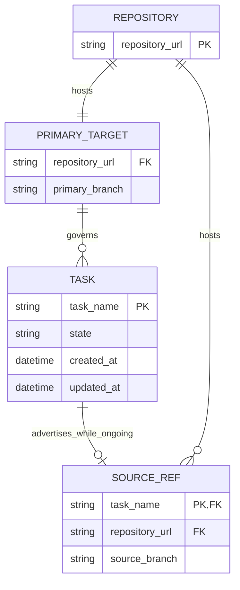

# Portable repository refs design

Status: Proposed for scope, business and data model, interface, and
architecture review

## Decision requested

Approve these decisions before implementation:

- identify the authority with a canonical HTTPS repository URL and branch,
  never a clone-local remote name;
- require every ongoing task to advertise one unique, remotely readable source
  branch, defaulting its repository to the primary repository; and
- make same-repository starts atomic while treating cross-repository starts as
  an explicitly recoverable, source-first two-repository operation.

The accepted task scope and completion conditions remain in [Task.md](./Task.md).

## Material changes

| Area | Current | Proposed | Why |
| --- | --- | --- | --- |
| Primary authority | `remote: origin` plus `primaryBranch` | `primaryRepository` plus `primaryBranch` | A remote name is local to one clone and may identify a fork elsewhere. |
| Ongoing work | Only lifecycle state and timestamps | `sourceBranch` plus an optional `sourceRepository` override | Another clone needs a shared rendezvous point to discover and continue work. |
| Git tracking refs | `refs/remotes/<remote>/<branch>` | `refs/repoledger/remotes/<repository-hash>/heads/<branch>` | Repoledger-owned refs must not depend on or collide with local remote aliases. |
| Start publication | One primary ref update | Atomic primary/source update in one repository; source-first publication across repositories | An ongoing record must not knowingly point at a source ref that was never published. |
| Completion | Approved primary commit only | Approved primary commit containing the source tip | Completion must not strand advertised, unintegrated work. |
| Migration | No repository-ref migration | One coordinated v1-to-v2 repository change | Old clients reject the new fields, so mixed or silently reinterpreted state is unsafe. |

## Target data model



`SOURCE_REF.repository_url` is the effective value. Storage omits it when it
equals `PRIMARY_TARGET.repository_url`; consumers always receive the effective
value.

### Configuration contract

`repoledger.yaml` becomes version 2:

```yaml
version: 2
tasksDirectory: tasks
primaryRepository: https://github.com/shazhou-ww/skills.git
primaryBranch: main
```

```ts
export type RepoledgerConfigV2 = {
  version: 2;
  tasksDirectory: string;
  primaryRepository: string;
  primaryBranch: string;
};
```

The property order shown above is canonical. `remote` is invalid in version 2;
its version 1 meaning is not changed in place.

### Status contract

`tasks/status.yaml` also becomes version 2:

```yaml
version: 2
tasks:
  portable-work:
    state: ongoing
    sourceBranch: task/portable-work
    createdAt: "2026-09-20T08:00:00Z"
    updatedAt: "2026-09-20T08:01:00Z"
  fork-work:
    state: ongoing
    sourceRepository: https://github.com/contributor/skills.git
    sourceBranch: task/fork-work
    createdAt: "2026-09-20T09:00:00Z"
    updatedAt: "2026-09-20T09:01:00Z"
```

```ts
export type TaskRecordV2 =
  | {
      state: "backlog" | "completed" | "abandoned";
      createdAt: string;
      updatedAt: string;
    }
  | {
      state: "ongoing";
      sourceRepository?: string;
      sourceBranch: string;
      createdAt: string;
      updatedAt: string;
    };
```

Canonical ongoing field order is `state`, optional `sourceRepository`,
`sourceBranch`, `createdAt`, then `updatedAt`. Backlog and terminal records
reject both source fields. The effective pair `(sourceRepository,
sourceBranch)` must be unique across ongoing tasks.

### Lifecycle semantics

| Entity | What can change | End condition | Deletion behavior |
| --- | --- | --- | --- |
| Primary target | Only an explicit repository relocation or schema migration changes it. | Replaced by a later valid configuration commit. | Never deleted implicitly. |
| Task | Legal lifecycle transitions and timestamps. | `completed` or `abandoned`. | Terminal records remain. |
| Source ref | Its Git tip may advance while the task is ongoing; its recorded repository and branch are stable for that ongoing interval. | Completion or abandonment removes the locator from current status. | Repoledger never deletes the Git branch. |

### Governing invariants

1. A repository URL is an absolute canonical `https:` URL with a host and
   non-root path. User information, passwords, query strings, fragments,
   trailing slashes, dot segments, encoded separators, and control characters
   are rejected. A `.git` suffix is allowed but not required.
2. URL identity is exact after URL canonicalization. Repoledger does not guess
   that SSH and HTTPS URLs, redirects, case variants, or paths with and without
   `.git` identify the same repository.
3. Git receives the canonical URL directly. Local credential helpers and
   `url.<base>.insteadOf` or `url.<base>.pushInsteadOf` may select credentials
   or SSH transport without changing committed state.
4. `primaryBranch` and `sourceBranch` are short branch names accepted by
   `git check-ref-format --branch`; neither contains a remote or `refs/`
   prefix. A source branch in the primary repository must differ from the
   primary branch.
5. Every ongoing task has exactly one effective source ref, and no two ongoing
   tasks advertise the same effective repository/branch pair.
6. The source branch is a mutable collaboration location, not accepted
   history. Human approvals still bind immutable commits, and completed work
   remains authoritative only after it reaches primary.
7. `task complete` requires the fetched source tip to be an ancestor of the
   exact delivery-approved primary commit. `task abandon` does not merge,
   rewind, or delete source work.

## CLI contract

### Initialization

```text
repoledger init --primary-repository <https-url>
                --primary-branch <branch>
                [--tasks-directory <path>]
```

Initialization fetches and publishes directly through the supplied URL. It
does not require, create, rename, or modify a local Git remote.

### Starting work

```text
repoledger task start <task-name>
                      [--source-repository <https-url>]
                      [--source-branch <branch>]
```

Defaults are the configured `primaryRepository` and `task/<task-name>`.
`sourceRepository` is omitted from canonical status when it equals the primary
repository. The result reports the effective repository, branch, source tip,
primary-before commit, primary-after commit, and whether publication was new,
already complete, or partially complete.

Repoledger leaves the caller's current branch and worktree unchanged. After
start, normal Git tooling advances the advertised source branch. Repository
skills will require implementation checkpoints to publish the source ref
before or with integration to primary so another participant can resume it.

### Reading and checking

`status` and `task list` retain their current filters and local/remote
semantics. For an ongoing task, text and JSON reports add the effective
`sourceRepository` and `sourceBranch`; omission in YAML is not exposed as a
missing effective repository. These read commands do not fetch every source
repository.

`check --remote` groups ongoing refs by canonical repository, fetches each
requested branch once, and reports its tip. It fails when a source repository
is unreadable, a branch is absent, two tasks share a source ref, or a source
tip does not descend from that task's published start commit. Diagnostics
distinguish primary access from source access and include the affected task and
ref without exposing credentials.

### Completing or abandoning

Completion fetches the source ref before validating reachability from the
approved primary commit. Completion and abandonment then remove both source
fields from status. Neither operation deletes or updates the remote source
branch.

There is no generic source-field setter in this change. A missing branch is
repaired by republishing the recorded branch. Moving an ongoing task to a
different repository or branch requires a separately designed compare-and-swap
operation rather than an unvalidated status edit.

## Git architecture

### Repository resolution

A shared URL never resolves through `git remote` names. Repoledger derives a
local tracking namespace from the SHA-256 digest of the canonical URL:

```text
refs/repoledger/remotes/<sha256>/heads/<branch>
```

Fetches use an explicit head-to-namespaced-ref refspec and `--no-tags`.
Force is allowed only on the local fetched tracking ref so a remote branch
rewind can be observed and diagnosed. Push refspecs never contain `+`.

URL parsing and canonicalization belong in a repository-locator module shared
by configuration, status validation, reporting, and Git operations. Git
process execution remains argument-array based with no shell interpolation.

### Same-repository start

1. Fetch primary and prove the selected task remains backlog.
2. Require the source branch to be absent, then create the deterministic start
   commit containing the ongoing record.
3. Push the commit to primary and the new source branch in one `--atomic`
   operation.
4. Use an explicit empty expected value for the source ref as a create-only
   compare-and-swap guard. This guard must reject an existing ref and may never
   authorize replacing one.
5. Fetch both refs and require both to equal the start commit.

If the server lacks atomic push support, the operation fails before either ref
changes. A concurrent primary update or source creation is a conflict; no
force update or inferred winner is allowed.

### Cross-repository start

Git has no transaction spanning two repositories, so the ordering is explicit:

1. Build the start commit on fetched primary.
2. Create the source branch in the source repository with an empty-ref
   compare-and-swap guard, then fetch it and require the exact start commit.
3. Push the same commit non-force to primary, then fetch and verify both refs.

If source publication fails, primary remains backlog. If source succeeds and
primary fails, the command returns `git.start.primary-pending`, the exact
candidate commit and published source ref, and a non-success exit code. A
retry may finish the same candidate only while its original primary parent is
still current. Otherwise repoledger leaves the harmless unregistered source
branch intact and requires an explicit new source branch or human cleanup; it
never rewrites or deletes the partial result.

If a source branch disappears after primary publication, the ongoing record
remains authoritative but remote validation fails with instructions to
republish that exact recorded ref from the start commit or a descendant.

### Subsequent source work

Repoledger does not commit implementation or continuously mirror refs. Normal
Git operations may advance the source branch, but publication must be
fast-forward and the tip must retain the start commit as an ancestor. A source
branch may be ahead of, equal to, or behind current primary while work is
ongoing. Delivery remains blocked until its fetched tip is contained in the
approved primary commit.

## Versioning and migration

Version 1 remains documented by the existing v1 schema and is never
reinterpreted. Version 2 gets a separate packaged schema. Normal v2 commands
reject v1 with a migration diagnostic rather than silently resolving a local
remote alias.

Migration is one coordinated repository operation, not a permanent generic
mutation command:

1. Refresh and validate v1 primary with the pre-migration CLI.
2. Select and review one canonical primary HTTPS URL. Do not infer it solely
   from a local remote when fetch and push URLs differ.
3. Assign every v1 ongoing task a unique source branch, using
   `task/<task-name>` in primary unless an explicit fork URL is required.
4. Write v2 configuration and status in one prospective tree. Preserve task
   names, states, `createdAt`, terminal timestamps, directories, and artifacts;
   advance `updatedAt` only for ongoing records whose source fields are added.
5. Create every same-repository source branch at the migration commit and
   atomically publish those refs with primary. Publish and verify any fork refs
   first, using the cross-repository partial-failure rules above.
6. Run the new local and remote checks against the resulting commit and refs.

Before publication, rollback discards the prospective commit and refs that
were not pushed. After any publication, corrections are forward operations;
history is never rewritten. Existing v1 installations fail clearly on v2 and
must upgrade before performing another repoledger operation.

For this repository, the migration creates
`task/support-portable-repository-refs` in the configured primary repository
at the migration commit and adds that source branch to the one current ongoing
record.

## Implementation boundaries

- [Configuration parsing](https://github.com/shazhou-ww/repoledger/blob/main/src/config.js) owns the v2
  top-level contract and delegates canonical URL validation.
- [Status parsing](https://github.com/shazhou-ww/repoledger/blob/main/src/ledger.js) owns the discriminated
  task-record union, field order, and transition projection.
- [Layout validation](https://github.com/shazhou-ww/repoledger/blob/main/src/layout.js) owns cross-record
  uniqueness and checks that depend on primary configuration.
- [Git operations](https://github.com/shazhou-ww/repoledger/blob/main/src/git.js) own URL-based fetch/push,
  namespaced refs, atomic same-repository publication, and ref verification.
- [Task publication](https://github.com/shazhou-ww/repoledger/blob/main/src/publication.js) owns start
  orchestration, cross-repository partial results, retries, and terminal source
  cleanup in status.
- [Remote checks](https://github.com/shazhou-ww/repoledger/blob/main/src/index.js) own source existence,
  ancestry, and completion reachability diagnostics.
- [Status reporting](https://github.com/shazhou-ww/repoledger/blob/main/src/status.js) resolves and exposes
  effective source repositories without adding network calls to list/status.

## Validation plan

- Unit-test canonical and rejected URLs, source-record unions, canonical field
  order, source defaults, uniqueness, and transition cleanup.
- Use canonical HTTPS fixture URLs rewritten through repository-local Git
  `url.*.insteadOf` settings to temporary bare repositories. This exercises
  the production URL path without committing machine-local file URLs.
- Integration-test atomic same-repository start, fork start, idempotent retry,
  source-only partial failure, source disappearance, ref collision, source
  ancestry, completion reachability, and non-deletion on terminal transitions.
- Test v1 rejection, the documented migration transform, v2 package schema,
  CLI help and JSON/text reports, package contents, and installed-package smoke
  behavior.
- Run `pnpm check`, `pnpm check:skills`, Markdown-link validation, Mermaid
  rendering, package checks, and `git diff --check` before delivery review.

## Approval request

Approve the scope in [Task.md](./Task.md) and the data model, CLI contract, and
Git architecture above for implementation at this exact published commit, or
identify the decision that should change before implementation begins.